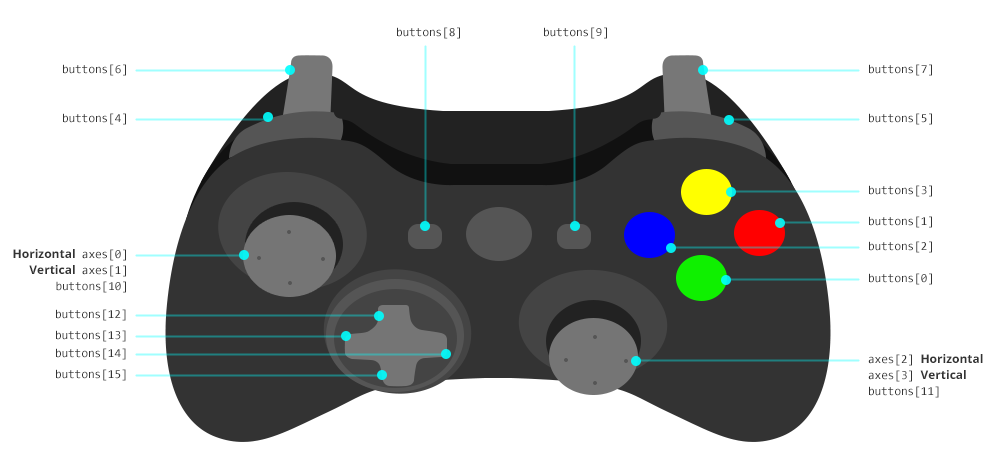

[](https://badge.fury.io/gh/tentone%2Fsyncinput)[](https://badge.fury.io/js/syncinput)

- Synchronous keyboard, mouse and gamepad input for fixed step applications.
- Multi-browser support, compatible with mobile devices and and touchscreen events.
- Currently supports input from: Mouse, Keyboard, Gamepad, Touchscreen
- Detailed API docs available on the docs folder of the project.
- [Demo of the library](https://tentone.github.io/syncinput/demo/) running from the examples directory.
- [TSDoc](https://tentone.github.io/syncinput/docs/) documentation available.

### Sync Events

- Browser events fire at a different rate than your application logic/render code.
- This library allow to access input state for variable frame rate scenarios.
- Skip the need to process out of sync browser callbacks.


### Getting Started
 - Get from NPM using ` npm install syncinput --save-prod`
 - Here is a small code example showing the basic functionality of the library.

```javascript
import {Keyboard, Keys, Mouse, MouseButton, Touch, Gamepad, GamepadButton} from 'syncinput';

//Initialization
mouse = new Mouse();
keyboard = new Keyboard();
touch = new Touch();
gamepad = new Gamepad();

[...]

//Inside of the logic/rendering loop
mouse.update();
keyboard.update();

console.log("Position X:" mouse.position.x + " Y:" + mouse.position.y);
console.log("Delta X:" mouse.delta.x + " Y:" + mouse.delta.y);
console.log("Scroll wheel:" mouse.wheel);


if (touch.touchJustPressed(0)) 
{
	console.log("First touch point just pressed.");
}
if (touch.touchJustReleased(1)) 
{
	console.log("Second touch point just released.");
}

if(mouse.buttonPressed(MouseButton.LEFT))
{
	console.log("Mouse left is pressed");
}

if(mouse.buttonPressed(MouseButton.LEFT))
{
	console.log("Mouse left is pressed");
}

if(keyboard.keyPressed(Keys.W) || gamepad.buttonPressed(GamepadButton.UP))
{
	console.log("W is pressed or Gamepad UP is pressed");
}

if(keyboard.keyJustPressed(Keys.W))
{
	console.log("W was just pressed");
}
if(keyboard.keyJustReleased(Keys.W))
{
	console.log("W was just released");
}
```

### Mouse

- `position {x, y}` -Actual mouse position
- `delta {x, y}` - Mouse delta since last time update() was called
- `wheel` - Mouse wheel value

- `buttonPressed(button)` - Check if mouse button is pressed (touchscreen tap same as left click)
- `buttonJustPressed(button)` - Check if mouse button was just pressed
- `buttonJustReleased(button)` - Check if mouse button was just released
- `setCanvas(canvas)` - Attach canvas to mouse object for position coordinated to be calculated relatively to the canvas.
- `insideCanvas()` - Check if mouse is inside attached canvas
- `setLock(value)` - Set mouse lock on/off.

### Keyboard

- `keyPressed(button)` - Check if key is currently pressed
- `keyJustPressed(button)` - Check if key was just pressed
- `keyJustReleased(button)` - Check if key was just released
- `reset()` - Reset all keys

### Touch
- `points[]` - List of touch points and their respective status.
- `pan(points)` - Multi-touch pan, retuns the average position and movement delta.
- `pinchZoom()` - Pinch to zoom (of the first two touch points) delta.
- `touchPressed(point)` - Check if touch point is pressed
- `touchJustPressed(point)` - Check if touch point was just pressed
- `touchJustReleased(point)` - Check if touch point was just released


### Gamepad
[Gamepad input](https://developer.mozilla.org/en-US/docs/Web/API/Gamepad_API) is only available in secure context using HTTPS. 

- `buttonPressed(button)` - Check if gamepad button is pressed
- `buttonJustPressed(button)` - Check if gamepad button was just pressed
- `buttonJustReleased(button)` - Check if gamepad button was just released
- `getAxis(index)` - Get axial input value from its index from -1 to 1.
- `getAnalogueButton(index)` - Get analog button from 0 to 1.
- `getGamepads()` - Get list of available gamepads.
- `setGamepad(gamepad)` - Set wich gamepad to use.

